# Setup Github Organizations for Labs

## Step One - Create a new GitHub Organization.

📌 **In the upper right corner, click the + button and choose `New organization`.**

<div align="center"></div>

## Step Two - Name the project.

📌 **Provide the name of your team's project. Keep in mind the naming convention used: `labs(cohort)-project-name.` You need to add a billing email, but will not be billed for an open source team.**

<div align="center"></div>
</br>
</br>

📌 **Then click create organization.**
</br>
</br>

<div align="center">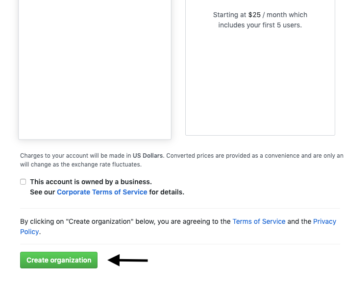</div>

</center>

## Step Three - Skip inviting members for now.

📌 **Click continue, we'll invite members to the team later.**

<div align="center">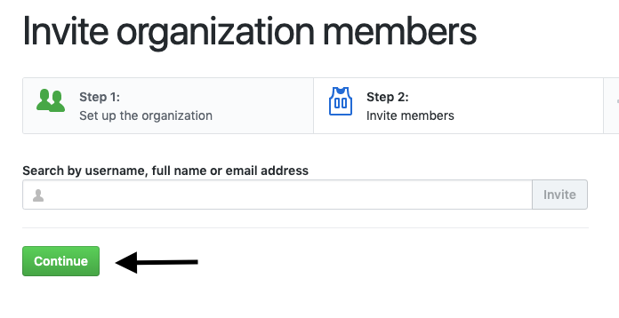</div>

## Step Four - Skip this step.

📌 **No need to fill out the data on this page, scroll to the bottom and click "skip this step."**

<div align="center">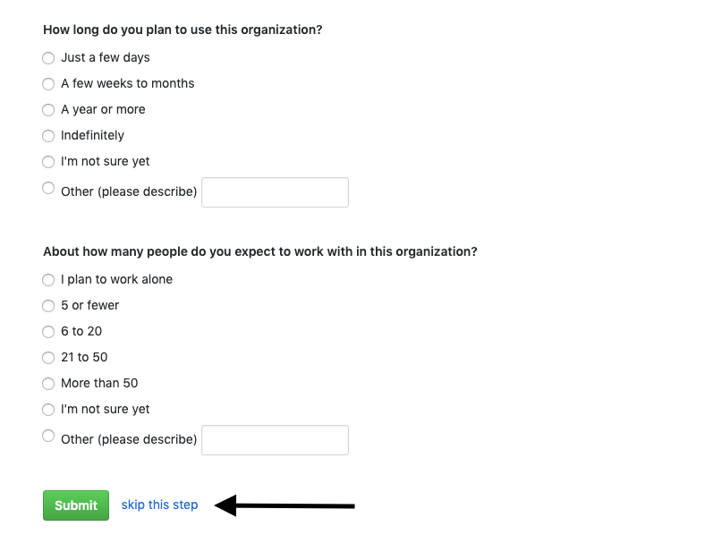</div>

## Step Five - Create a new repository.

📌 **Click Create a New Repository. Make sure to give it a name, make sure it's public, initialize with a readme, and add an MIT license. Repeat this step for frontend, backend, and if applicable add Android, iOS, and data science.**

<div align="center">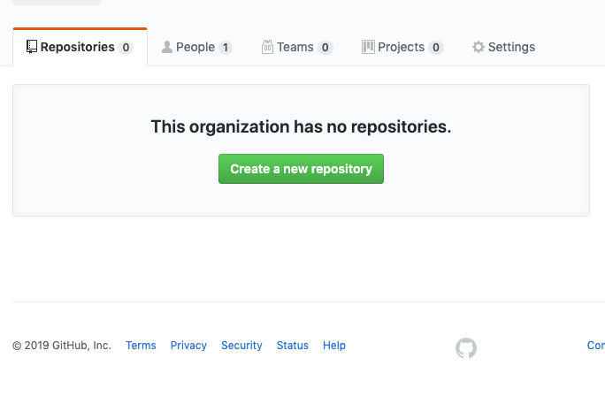</div>

<div align="center">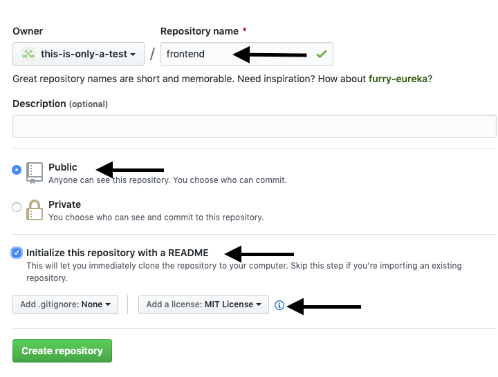</div>

## Step Six - Copy _ALL_ relevant master markdown files to the new repo (IE: Frontend files for Frontend, Backend for backend, Android for Android).

📌 **Navigate to the [Lambda X Master Organization](https://github.com/Lambda-X-Master) and choose the repository you wish to duplicate.**

<div align="center">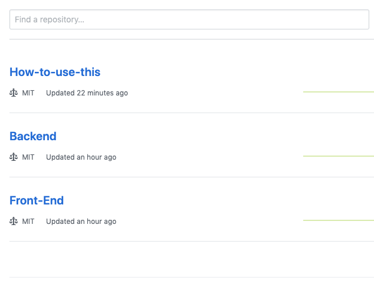</div>
<br>

📌 **Access the readme file and open the raw version.**

<br>

<div align="center">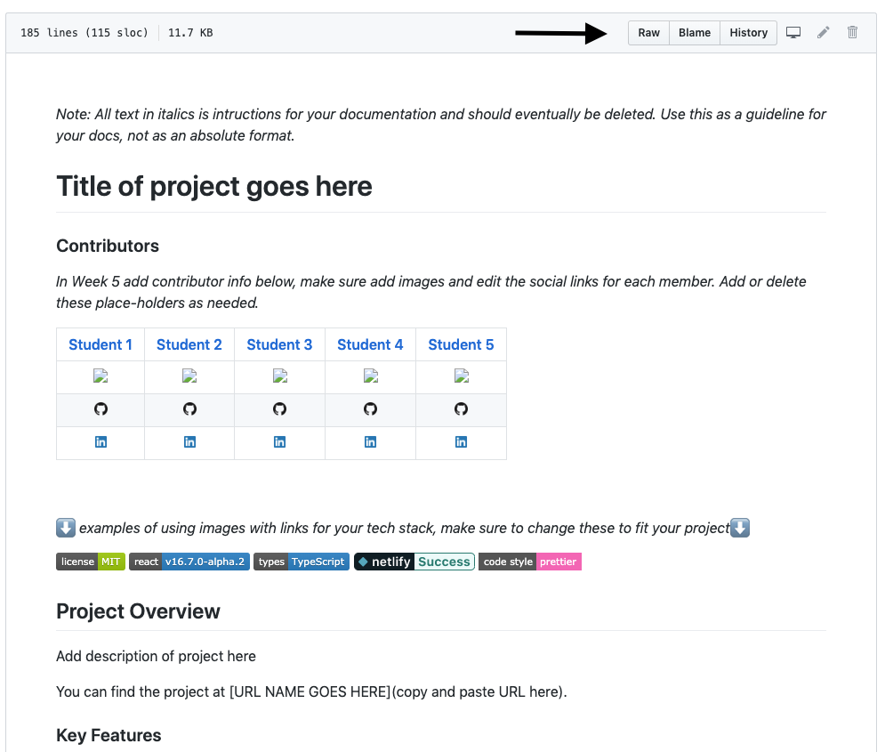</div>
<br>

📌 **Select all then copy and paste the text into the readme of the newly created repository using the edit option.**

<br>

<div align="center">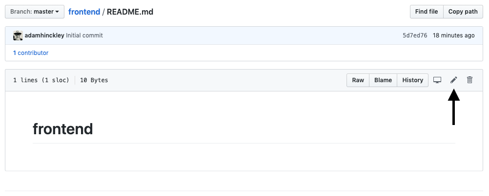</div>
<br>

📌 **Copy all other files including images (if applicable) into the new repo.**

📌 **Commit the changes.**

<br>

<div align="center">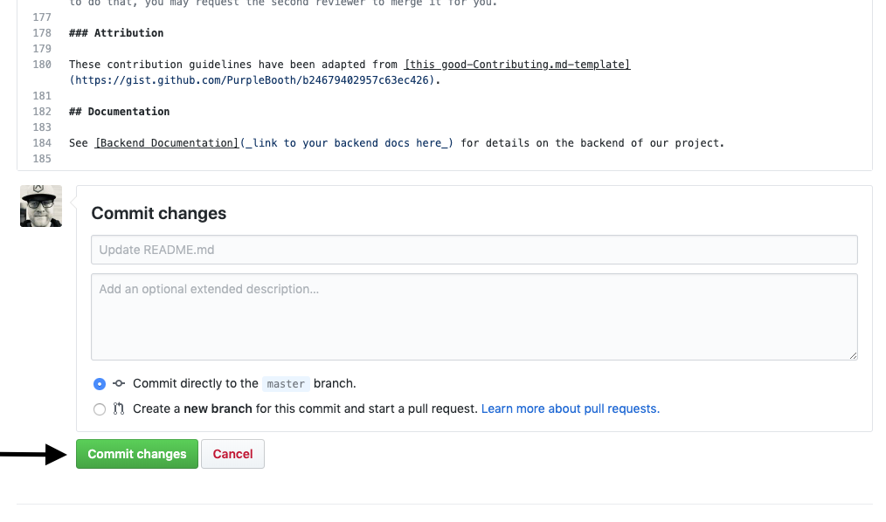</div>

#### Repeat this process for any other markdown files in the repo you are duplicating

## Step Seven - Add rules to master branch.

📌 **In each separate repository go to settings -> branches and click `add rule.`**

<div align="center">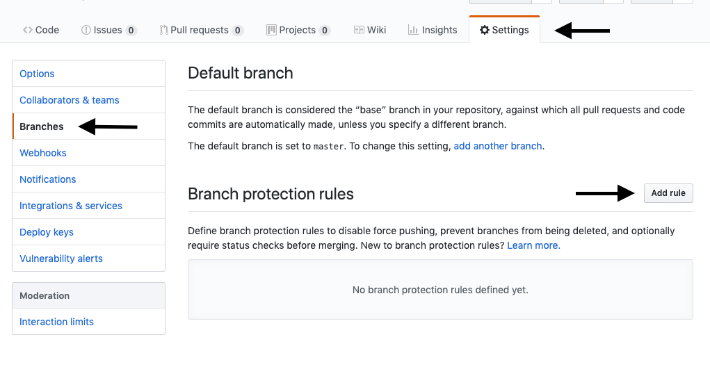</div>

📌 **Branch name pattern = master.**

<div align="center">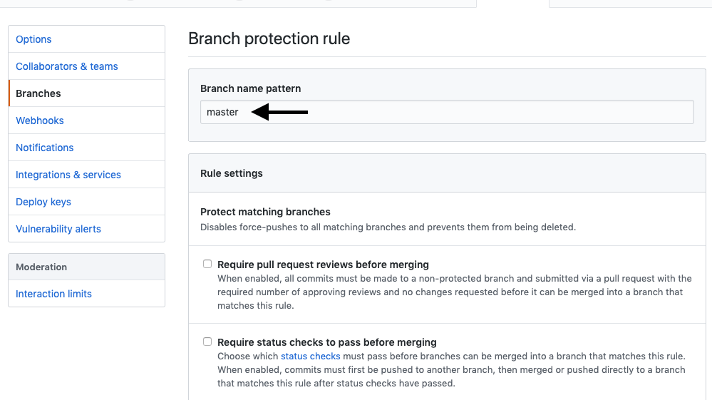</div>

📌 **Check the following box requiring one review before merging to master.**

<div align="center">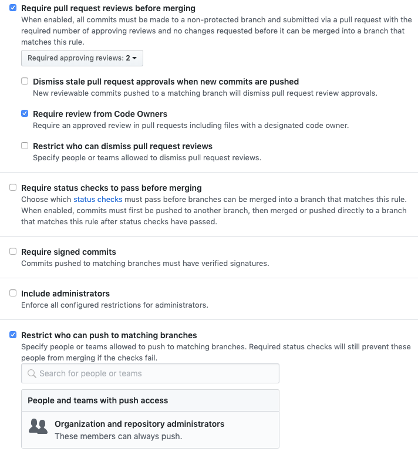</div>

📌 \*\*Make sure to do this for every repository in the organization.

## Step Eight - Invite members to the team

📌 **One organization page click the people tab then `invite member` then invite them by their GitHub handle or email address.**

📌 **Make sure to add all section leads, Team Leads and members as owners.**

<div align="center">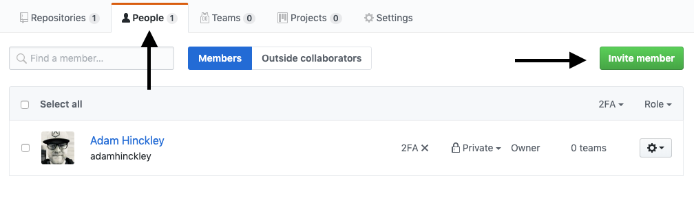</div>

📌 **All section leads, team leads and members should have a `Owner` access**

<div align="center">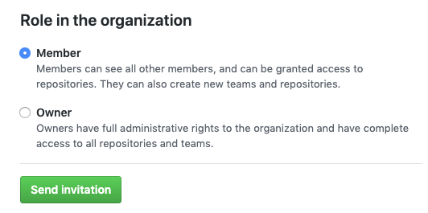</div>

## Step Nine - Give members write access.

📌 **In every repository in the organization go to settings -> member privileges and change the base permission from read to write.**

<div align="center">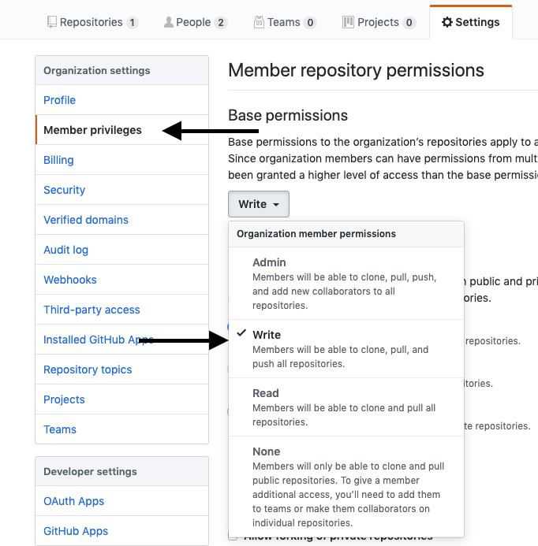</div>

## Step Ten - Add pull request template to project.

📌 **In every repository in the organization, create a file in the root directory named `pull_request_template.md` and paste the following:**

```
# Description

Describe change or new feature here.

## Checklist

Remove any items which are not applicable.

- [ ] I have performed a self-review of my own code
- [ ] I have commented my code, particularly in hard-to-understand areas
- [ ] I have made corresponding changes to the documentation
- [ ] I have added tests that prove my fix is effective or that my feature works AND the tests pass

```

