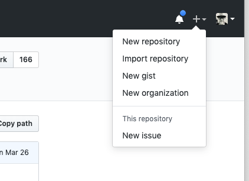
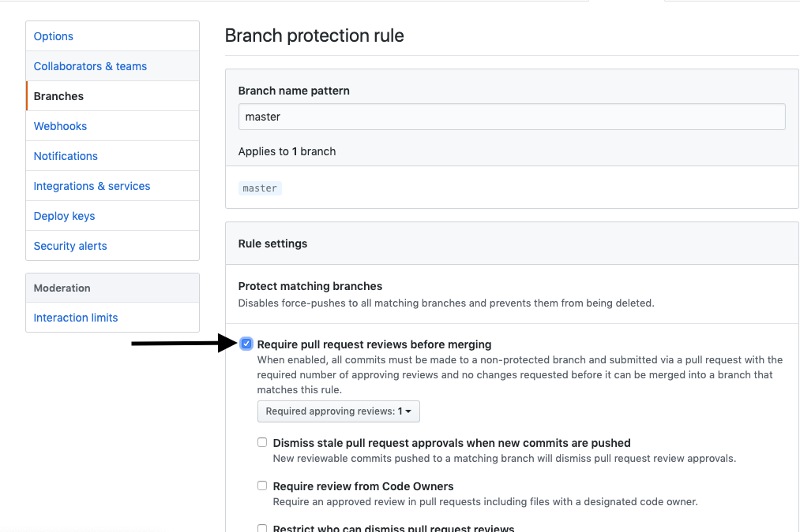
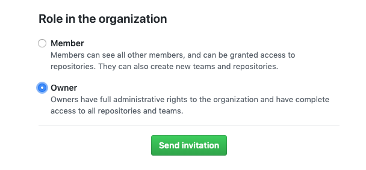

# Setup Github Organizations for Labs

## Step One - Create a new GitHub Organization

In the upper right corner, click the + button and choose `New organization`

## Step Two - Name the project

### Provide the name of your team's project. Keep in mind the naming convention used: `labs(cohort)-project-name.` You need to add a billing email, but will not be billed for an open source team.

### Then click create organization

## Step Three - Skip inviting members for now

### Click continue, we'll invite members to the team later.

## Step Four - Skip this step

### No need to fill out the data on this page, scroll to the bottom and click "skip this step."

## Step Five - Create a new repository

### Click Create a New Repository. Repeat this step for frontend, backend, and if applicable add Andriod, iOS, and data science.

## Step Six - Copy the master markdown files to the new repo

### Navigate to the [Labs-Master organization](https://github.com/labs-master) and choose the repository you wish to duplicate.

 

### Access the readme file and open the raw version

 

 

### Select all then copy and paste the text into the readme of the newly created repository using the edit option.

 

 

### Commit the changes

 

#### Repeat this process for any other markdown files in the repo you are duplicating

## Step Seven - Add rules to master branch

### In each separate repository go to settings -> branches and click `add rule.`

### Branch name pattern = master

### Check the following boxes and set the required approving reviews to two.

### `Make sure to do this for every repository in the organization.`

## Step Eight - Invite members to the team

### One organization page click the people tab then `invite member.`

### If they are a PM or higher, give them the role of `Owner.` Students get the role of `Member.`

## Step Nine - Give members write access

### In every repository in the organization go to settings -> member privileges and change the base permission from read to write.

